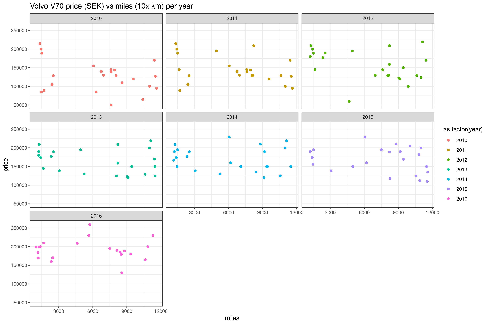

I wanted to get an overview of reasonable car prices for Volvo V70 in relation to year and mileage (in Sweden).

This code use R to extract information from a Swedish website for second hand cars (bytbil.com).

The example below is for Volvo V70, but can of course be adapted to any car.

Next:

* Retrieve mileage and compare to price
