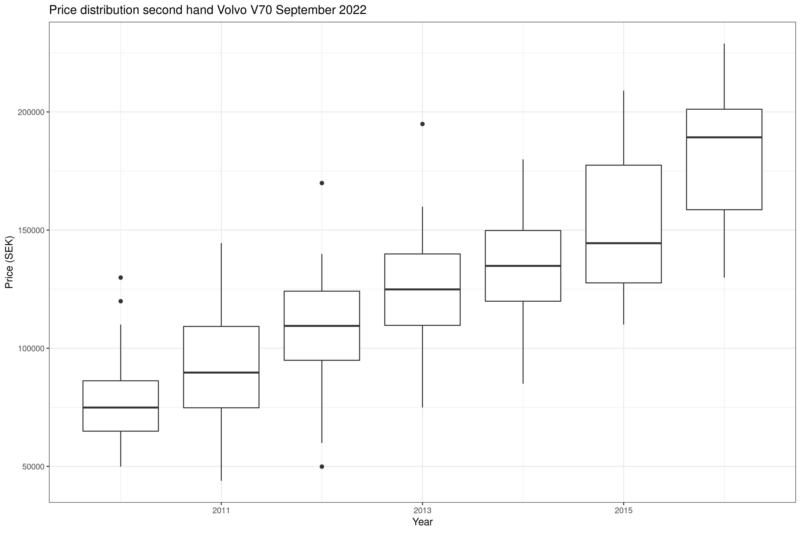

I wanted to get an overview of reasonable car prices for Volvo V70 in relation to year and mileage (in Sweden).

This code use R to extract information from a Swedish website for second hand cars (bytbil.com).

The example below is for Volvo V70 (September 2022), but can of course be adapted to any car.

Notes

* There is an anomaly in the data where some cars had extreme mileage (1000000+ km). This is likely a parsing error. Some cars where filtered out here.
* If this breaks any terms of usage, let me know and I'll immediately remove any sensitive parts.

